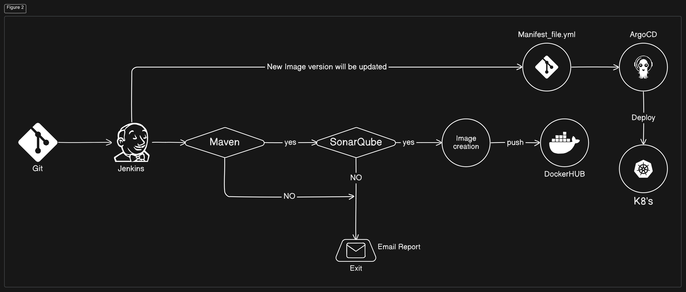

# Java Application CI/CD Pipeline with Jenkins, Maven, SonarQube, Argo CD, and Kubernetes

This project demonstrates how to automate the deployment of a Java application using Jenkins, Maven, SonarQube, Argo CD, and Kubernetes. The goal is to streamline the application lifecycle from development to production deployment.

## Tools and Technologies Used:
- **Jenkins**: Continuous Integration (CI) server for automating build and testing processes.
- **Maven**: Dependency management and packaging tool for Java applications.
- **SonarQube**: Static code analysis tool for ensuring code quality and security.
- **Argo CD**: Continuous Delivery (CD) tool for automating deployments on Kubernetes clusters.
- **Kubernetes**: Container orchestration platform to manage and scale applications.

---

## Prerequisites
- Java application source code stored in a Git repository.
- A running Jenkins server.
- A SonarQube server.
- Argo CD installed on Kubernetes.

---

## Steps to Set Up the Jenkins, SonarQube, and Argo CD Servers

### 1. **Installing the Jenkins Server**

#### Prerequisites:
- Java
- Docker
- Docker Buildx

#### Steps to install Java:
```bash
sudo su 
apt-get update -y
apt install openjdk-17-jdk -y
java --version
```

#### Install Docker and Docker Buildx:
```bash
apt install docker.io -y
apt install docker-buildx -y
docker --version
docker builder ls
```

#### Install Jenkins:
```bash
sudo wget -O /usr/share/keyrings/jenkins-keyring.asc https://pkg.jenkins.io/debian-stable/jenkins.io-2023.key
echo "deb [signed-by=/usr/share/keyrings/jenkins-keyring.asc] https://pkg.jenkins.io/debian-stable binary/" | sudo tee /etc/apt/sources.list.d/jenkins.list > /dev/null
sudo apt-get update
sudo apt-get install jenkins
```
By default, Jenkins runs on port 8080. Access Jenkins at `http://<your-ip>:8080`.

#### Set up Jenkins:
1. Install necessary plugins: `docker pipeline`, `docker-build-step`, `docker plugin`, `SonarQube scanner`, `maven`.
2. Restart Jenkins.
3. Configure tools: Set up SonarQube scanner and Maven in **Manage Jenkins > Tools**.

### 2. **Installing the SonarQube Server**

#### Prerequisites:
- Java
- Zip

#### Steps to Install SonarQube:
```bash
sudo su 
apt-get update -y
apt install openjdk-17-jdk -y
apt install zip
```

Create a user for SonarQube:
```bash
adduser sonarqube
su - sonarqube
```

Download and install SonarQube:
```bash
wget https://binaries.sonarsource.com/Distribution/sonarqube/sonarqube-9.9.8.100196.zip
unzip sonarqube-9.9.8.100196.zip
chmod -R 755 /home/sonarqube/sonarqube-9.9.8.100196
chown -R sonarqube:sonarqube /home/sonarqube/sonarqube-9.9.8.100196
```

Start the SonarQube server:
```bash
cd sonarqube-9.9.8.100196/bin/linux-x86-64/
./sonar.sh start
```

SonarQube runs on port 9000 by default (`http://<your-ip>:9000`). 

The Username is `admin` and Password is `admin`

#### Configure SonarQube in Jenkins:
1. Generate a token in SonarQube (My Account > Security > Generate Tokens).
2. In Jenkins, go to **Manage Jenkins > Manage Plugins**, install the SonarQube Scanner plugin.
3. Add SonarQube server details in **Manage Jenkins > Configure System**.
4. For Detail steps Refer Document.👉
[SonarQube Configuration Guide](https://medium.com/@charanv369/automating-java-application-deployment-with-jenkins-maven-sonarqube-argo-cd-and-kubernetes-d4208e1dd639)
---

### Configure Docker hub with Jenkins:
1. Go to Manage Jenkins > Credentials.
2. Go to Stores scoped to Jenkins > Global > Add Credentials.
3. kind: username and passsword
4. id github-cred > create

### Generating git token key
1. Go to Github account > settings > Developer Settings > Personal access Token > Tokens (classic) > Generate new token > Generate new token(classic) == repo (select) > generate token.
3. Once the token is generated, copy it immediately. You won't be able to see it again, so save it in a secure place.

#### Configure Git Token with Jenkins:
1. Go to Manage Jenkins > Credentials.
2. go to Stores scoped to Jenkins > Global > Add Credentials.
3. Kind: Secret Text
4. paste the token in the secret text Colom
5. ID github-cred > Create
##
### 🧠 Restart the Jenkins Server after all configuration is done. IP-Address:8080/restart
---

### 3. **Installing Argo CD**

#### Prerequisites:
- Minikube
- Docker
- Kubernetes

#### Steps to Install Kubernetes and Docker:
1. Install Kubernetes (kubectl) by following the official documentation: [Kubernetes Installation Guide](https://kubernetes.io/docs/tasks/tools/install-kubectl-linux/).
2. Install Docker: [Docker Installation Guide](https://docs.docker.com/engine/install/ubuntu/).
3. Install Minikube: [Minikube Installation Guide](https://minikube.sigs.k8s.io/docs/start/).

#### Install Argo CD:
```bash
kubectl create namespace argocd
kubectl apply -n argocd -f https://raw.githubusercontent.com/argoproj/argo-cd/stable/manifests/install.yaml
```

Check if Argo CD is properly installed:
```bash
kubectl get pods -n argocd
kubectl get svc -n argocd
```

Change the `argocd-server` service to **NodePort** for external access and port-forward:
```bash
kubectl port-forward -n argocd svc/argocd-server 8080:80 --address 0.0.0.0 &
```

To get the ArgoCD password:
```bash
kubectl get secrets -n argocd
kubectl edit secrets argocd-initial-admin-secret
echo <password> | base64 --decode
```
For Detail steps Refer Document.👉
[Argocd Install Guide](https://medium.com/@charanv369/automating-java-application-deployment-with-jenkins-maven-sonarqube-argo-cd-and-kubernetes-d4208e1dd639)
---

### 4. **Creating a Jenkins Pipeline for the Java Application**

#### Steps:
1. Create a new Jenkins pipeline job.
2. Configure the Git repository URL: `https://github.com/your-repository/java-cicd-argo.git`.
3. Define the pipeline using Jenkinsfile and include build, test, and deploy steps.

---

### 5. **Deploy the Application Using Argo CD**

#### Steps:
1. Create a new Argo CD application in the **Argo CD UI**:
   - **Source**: Git repository URL.
   - **Path**: Kubernetes manifest file.
   - **Destination**: Kubernetes cluster.
2. Argo CD will automatically deploy your Java application when there is a change in the Git repository.

---

### 6. **Automating the Deployment with Jenkins and Argo CD**

Whenever Jenkins builds a new version of the Java application, it will:
1. Update the Kubernetes manifest files.
2. Argo CD will automatically sync the changes and deploy the new version to the Kubernetes cluster.

To access the new version, port-forward the application’s service:
```bash
kubectl port-forward -n default svc/my-service 8081:80 --address 0.0.0.0 &
```

---

## Conclusion

This project demonstrates how to automate the Java application deployment process using a combination of Jenkins, Maven, SonarQube, Argo CD, and Kubernetes. With this setup, you can efficiently handle the entire CI/CD pipeline, ensuring faster, reliable, and error-free deployments.

---

If you found this guide helpful, feel free to follow me on [LinkedIn](https://www.linkedin.com/in/vootlasaicharan) for more DevOps-related content and project guides. Thank you for reading!

This README file should provide a comprehensive guide to setting up the pipeline and deploying Java applications automatically. Feel free to modify it according to your specific needs!